# Dataiku Gitops Integration

## OVERVIEW

This document is a guide to configuring a typical Dataiku gitops lifecycle, in which project versions are pushed to Github repositories, and optional tests are run both before moving the project bundle to a staging area and also before deploying to the production environment. In this case, the test comprises confirming the presence of the project’s ML model(s) in Weights and Biases (W&B) before the project can be staged, and ultimately deployed. Find code files at <a href="https://www.google.com/url?q=https://github.com/evanguarnaccia&amp;sa=D&amp;source=editors&amp;ust=1767464092301144&amp;usg=AOvVaw3RQk7RRx1UInA9xiSNslK6" class="c5">https://github.com/evanguarnaccia</a>

## GOALS

1.  Provision and configure dev, staging, and prod environments
2.  Connect DSS project to remote Github repository
3.  Install and customize oneai plugin for W&B
4.  Configure Dataiku Github action to check W&B upon commit
5.  Successfully execute tests to deploy to staging and prod

## Milestones

- Configure nodes
- Configure Secrets
- Create Github repository
- Add remote to project
- Initialize Github repository
- Setup Github action
- Create Deployment Test
- Configure One.Ai plugin
- Push ML model to W&B
- Create new project branch
- Test and Deploy

### Configure Nodes

This pipeline will consist of three nodes, a design node for development, and automation nodes for staging and production.

Create the needed instances in Fleet Manager

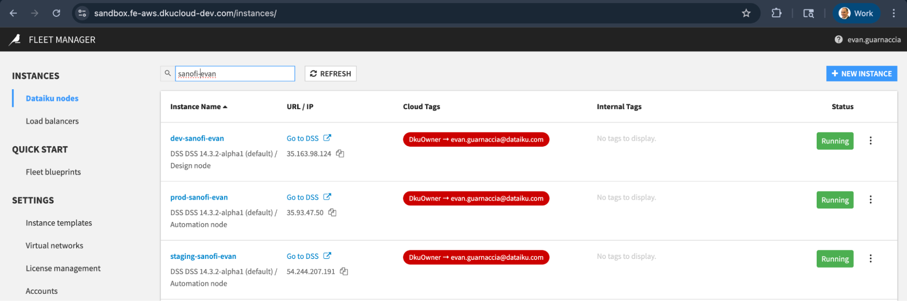

Go to the design node, and navigate to the big menu in the top right, and click on “Local Deployer”, as shown below

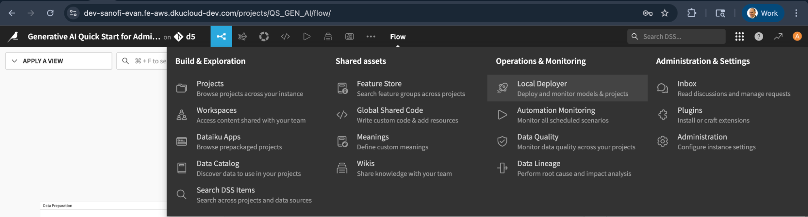

From the Local Deployer, select “Deploying Projects”, and then navigate to the “Infrastructures” tab, and click “+ New Infrastructure” and populate the fields. Make sure to use the correct “Lifecycle stage” setting for each.

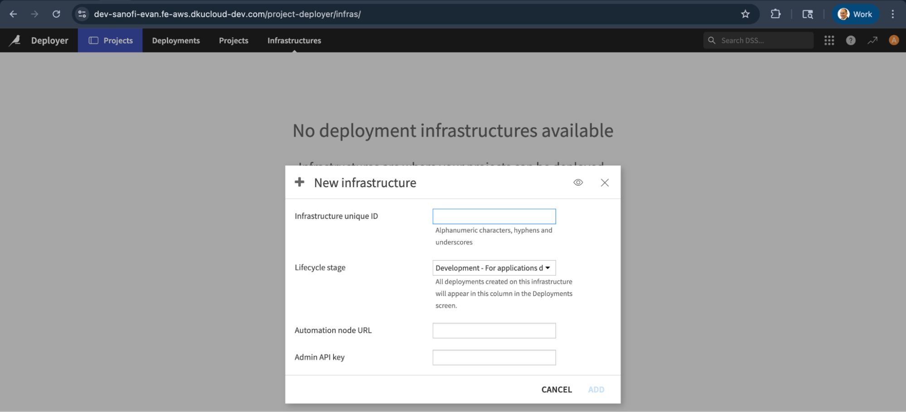

After setting those fields, click “ADD”, and when brought to the following screen, click “Trust all certificates” and click “Save”

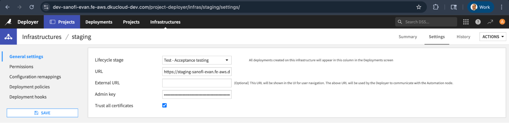

If done properly, both infrastructures should be registered with the deployer. Take note of the IDs used here, as they will be used as environment variables in Github.

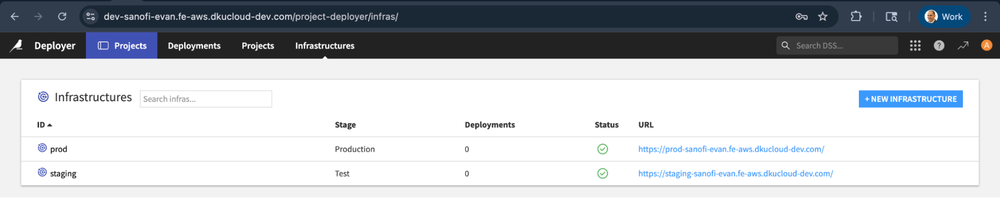

### Configure Secrets

To set the secrets, for each instance, generate an API key for the user by going back to DSS and clicking on the user profile in the top right of the page. From there, click the gears, and then select the API keys. Create an API key for this purpose on the page shown below

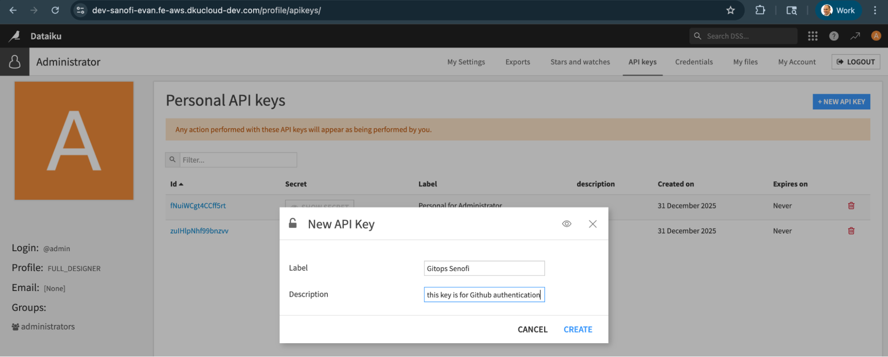

Navigate to the “Credentials” tab, and enter the W&B account API key

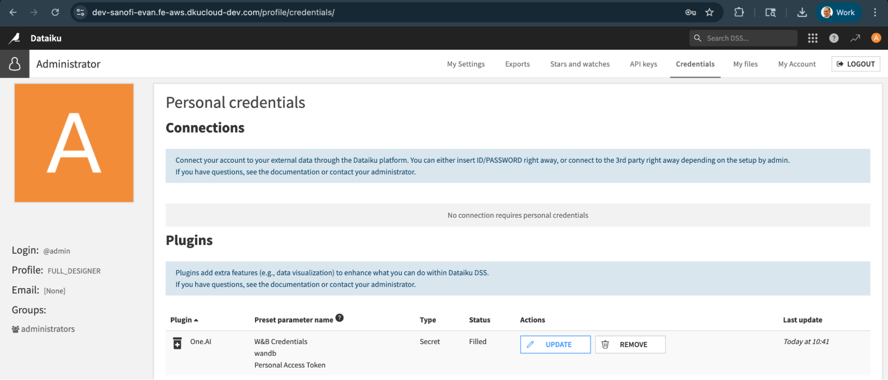

Finally, navigate to the “My Account” tab, and add a credential called “wandbcred”, and set the value as the previously used W&B account API key.

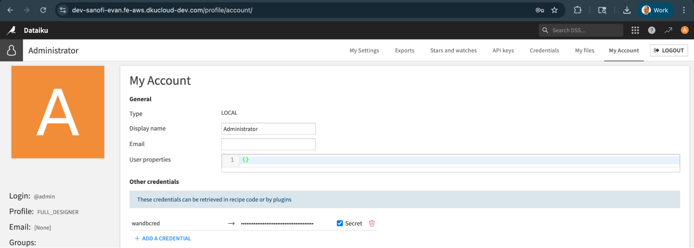

### Create Github repository

Before a project can be pushed to Github from DSS, a blank repository must first be created. Create a bare public repository as shown below, and copy the SSH link to the repository.

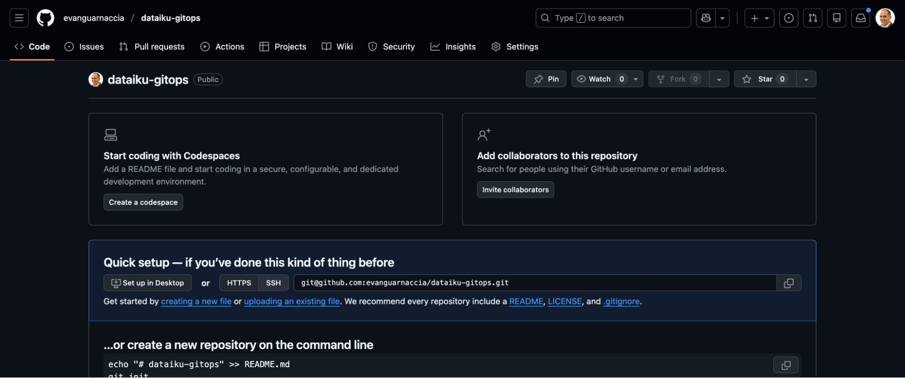

### Add Remote to Project

Go to DSS and navigate to the “Version Control” tab as shown

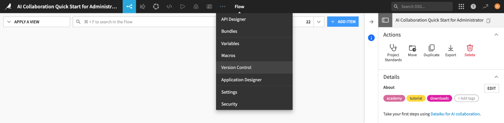

From there, click on the area shown below, and select “Add remote”

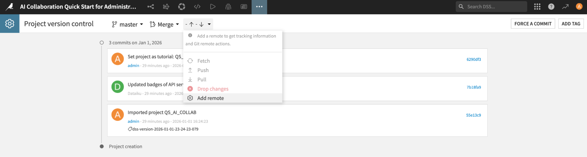

Enter the SSH link copied in the previous step, and if done properly, it should look like this

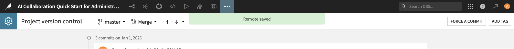

### Initialize Github Repository

To initialize the github repository for this project, the first step is to push the project to it. Go to the menu as shown and click “Push”. Also take note that the name of the branch is “master”.

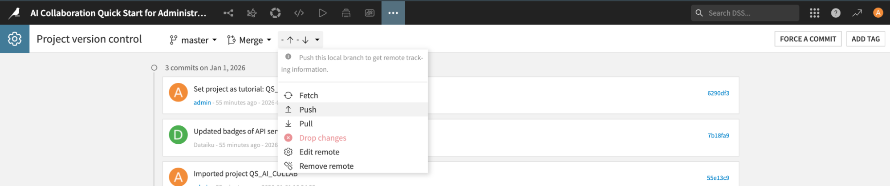

If done correctly, the Github repository setup earlier should be populated with files, similar to this

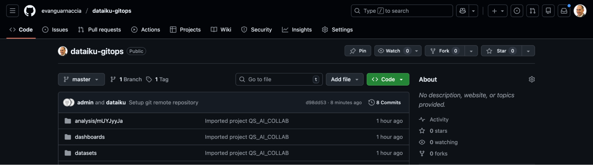

### Setup Github Action

From the screen above, click “Add file”, and give it the name “.github/workflows/pr.yml”. Populate the file with the example code as shown below. Change the branch name to “master” as noted earlier. In this case, the Github action needed to be modified, so a mirror was created of the repository containing the original Github action. Change the value on line 17 of the file below to match the mirrored repo..

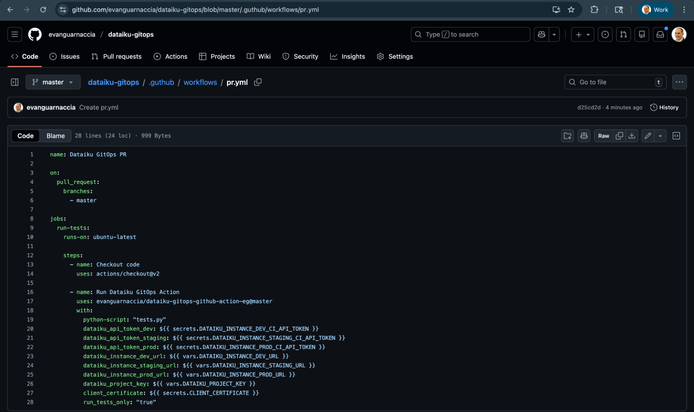

Create another file in the same directory called “release.yml” and populate it with the example code and necessary modifications, as shown below. Note that there are two additional environment variables: DATAIKU_INFRA_STAGING_ID and DATAIKU_INFRA_PROD_ID. These are the infrastructure ids created earlier.

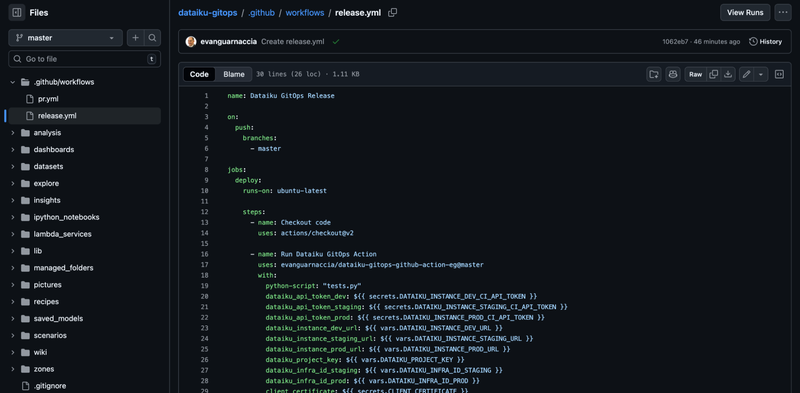

The next step is to set the environment variables. Click “Settings” near the top middle of the screen, click “Secrets and variables”, and then click “Actions”. Use the tabs in the page shown below to add the secrets and variables.

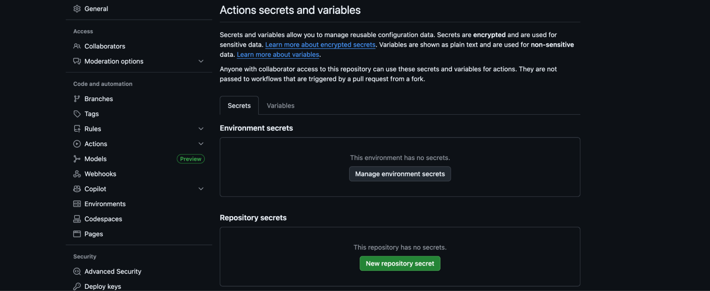

Navigate to the mirror of the Github action, and edit “dataiku_gitops_action.py” in two places. First, add the ‘-s’ option to print to the console, as shown below

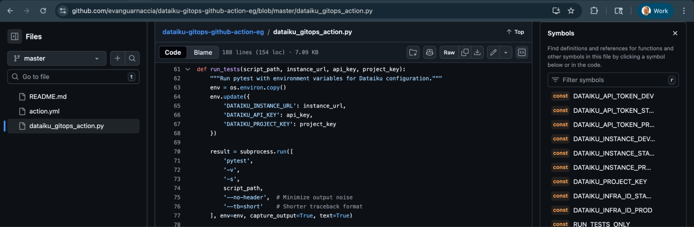

Finally, comment out this block which checks agreement between commit SHAs

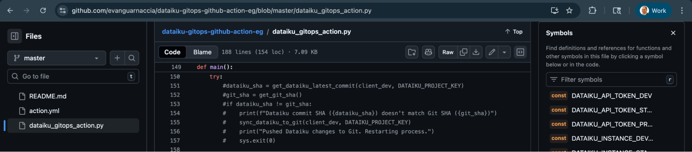

Optionally, add code to append a timestamp to the bundle id, as shown below, to avoid collisions

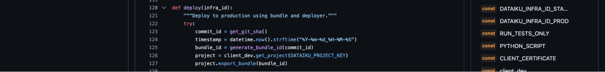

### Create Deployment Test

The Github action used in this workflow allows a user-defined test to be run, and as suggested in pr.yml and release.yml, the test is contained in a file called “<a href="https://www.google.com/url?q=http://tests.py&amp;sa=D&amp;source=editors&amp;ust=1767464092307914&amp;usg=AOvVaw2xZpuo8WIjqmjfTFjGxSE1" class="c5">tests.py</a>”. Create this file and populate it with that code, as shown below

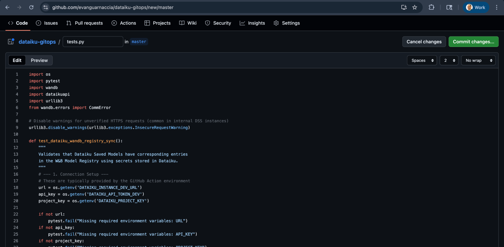

### Configure oneai plugin

To push ML models directly from DSS to Weights and Biases, a custom plugin is needed. Download the oneai plugin, and go to DSS. Open the menu in the top right corner, and under “Administration & Settings”, click “Plugins”. Click “Add plugin” in the top right corner, and then upload the zip file.

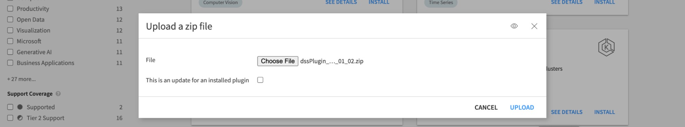

Once the plugin in installed, it should be available as shown below

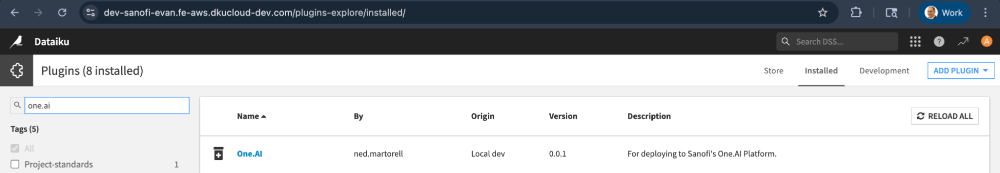

Click on “<a href="https://www.google.com/url?q=http://one.ai&amp;sa=D&amp;source=editors&amp;ust=1767464092308738&amp;usg=AOvVaw1-ibeG2Uc7m0ouNiEBU_aS" class="c5">One.Ai</a>” and then “Actions” in the top right corner. Click “Convert to dev plugin…” so the code can be edited. 

Navigate to the “Edit” tab and make changes to runnable.json as shown below. This will allow the plugin user to set the parameters for pushing the ML model to W&B  
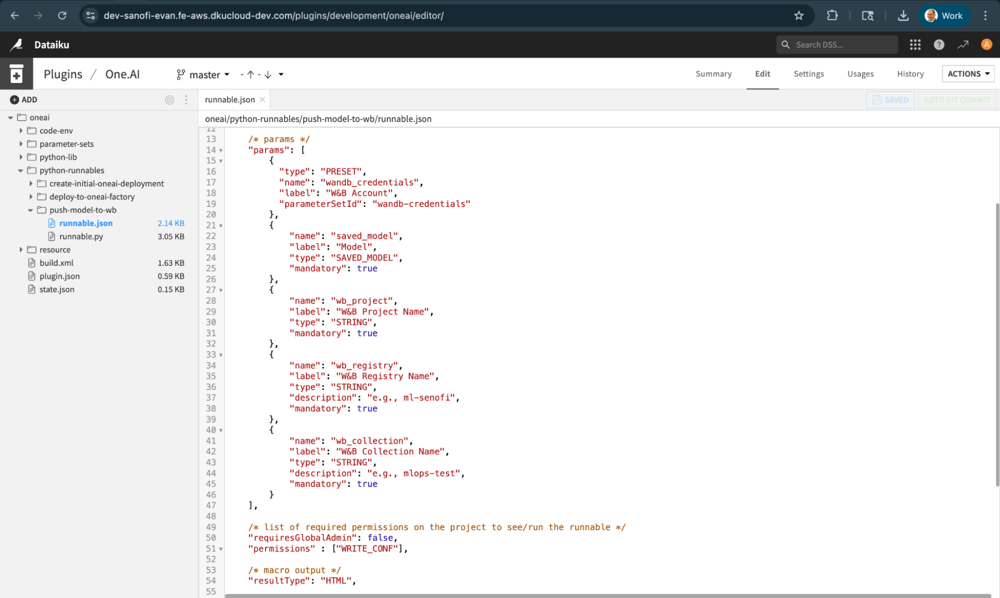

Next, make changes to <a href="https://www.google.com/url?q=http://runnable.py&amp;sa=D&amp;source=editors&amp;ust=1767464092309288&amp;usg=AOvVaw0bdZ_kE-pBexnBr0mm7DV9" class="c5">runnable.py</a> so that the parameters are passed to the code which is talking to W&B, as shown below. Make sure the rest of the code is properly referencing those new variables.

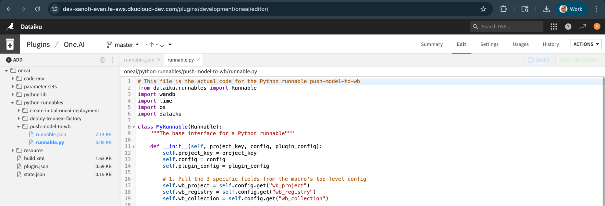

Navigate to the “Settings” tab on this page, and then to “W&B Credentials”. Create a preset as shown below.

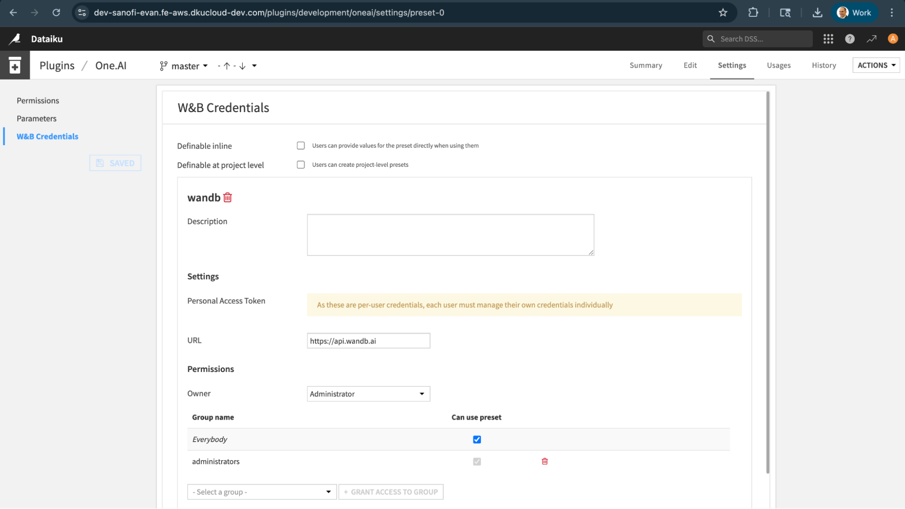

### Push ML model to W&B

Go to the project in DSS to be deployed, and click on the ML model in the flow, as shown below

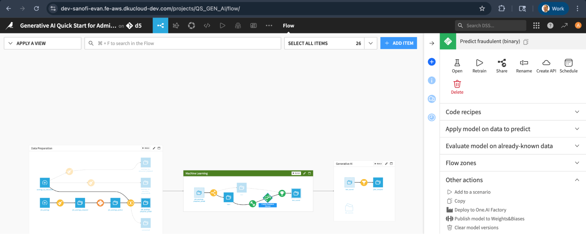

Click on “Publish model to Weights&Biases” and fill in the menu that pops up, including the preset defined earlier. Click “RUN MACRO”

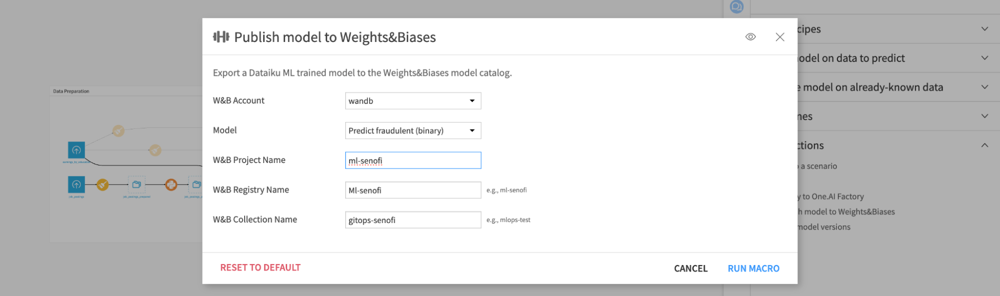

If done properly, the ML model should be pushed successfully to W&B

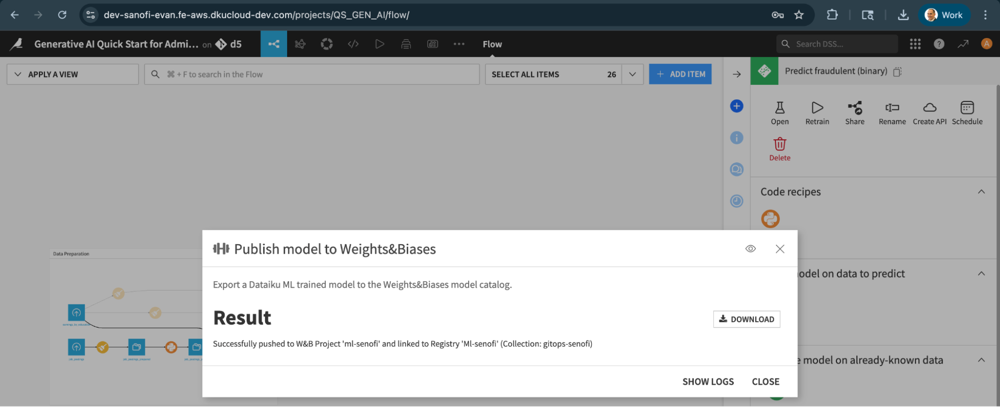

### Create New Project Branch

To make a pull request to the Github repository, first create a new branch of the project before making changes to the project. Go to the “Version control” tab, and create a new branch as shown below. For simplicity, use the current project

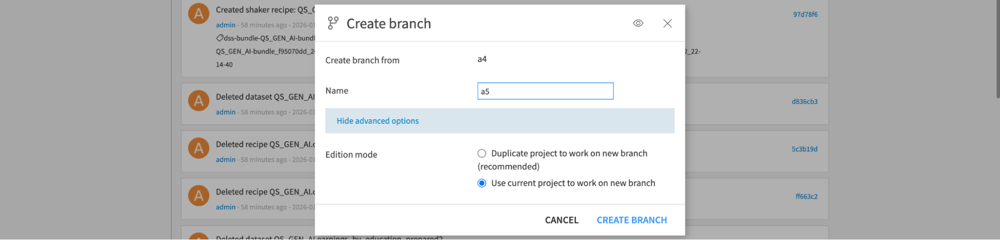

Make the changes to the project, and navigate back to “Version control”, and this time select “Push”, as shown below

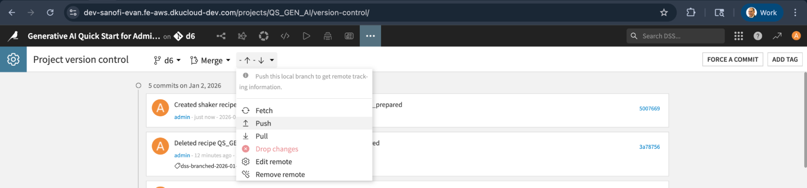

A successful push will look similar to what is shown below

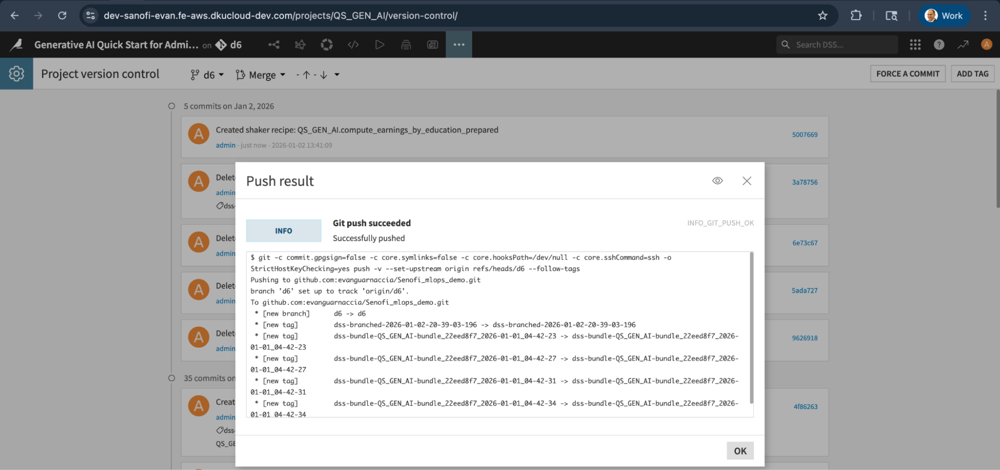

### Test and Deploy

If the previous steps have been done properly, the github repo should have an option to click “Compare & pull request”, as shown below. This click-through sets in motion the chain of events which apply the tests and deploy to staging and prod if passed.

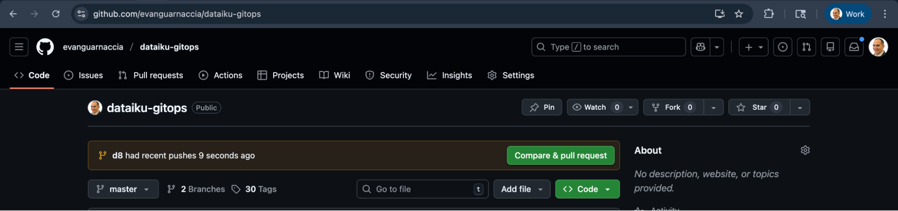

Click “Create pull request”, as shown below

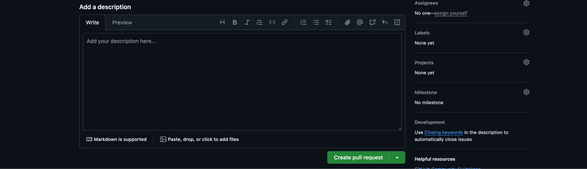

Click “Merge pull request”

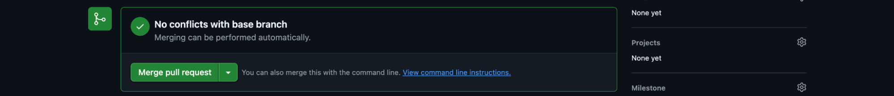

Observe that the tests are being run, and click on “Details”

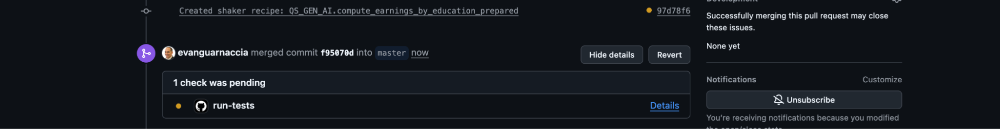

If successful, the output of the tests will be on the console as shown below

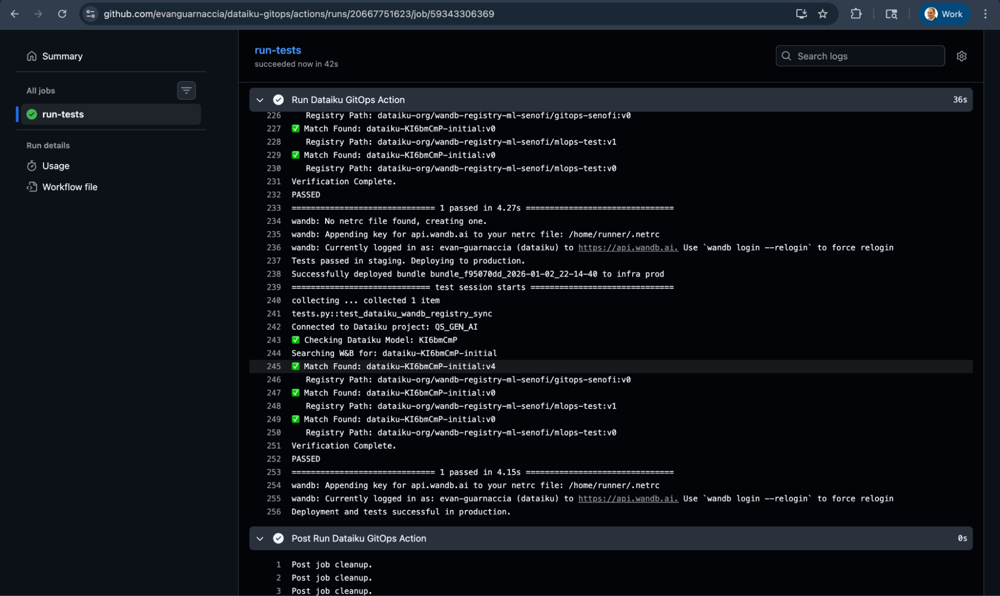

And the latest version of the project has been deployed to both staging and production.

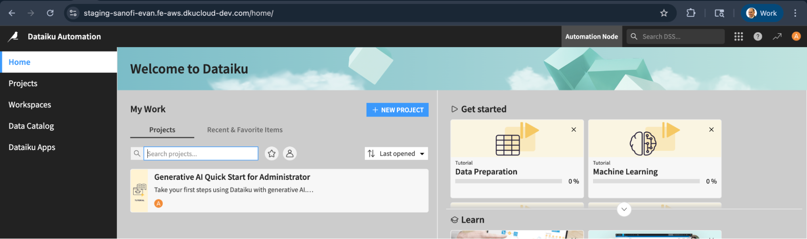

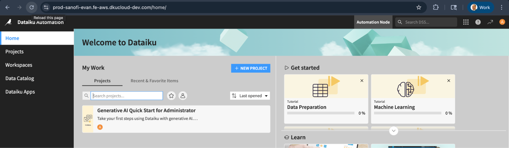

